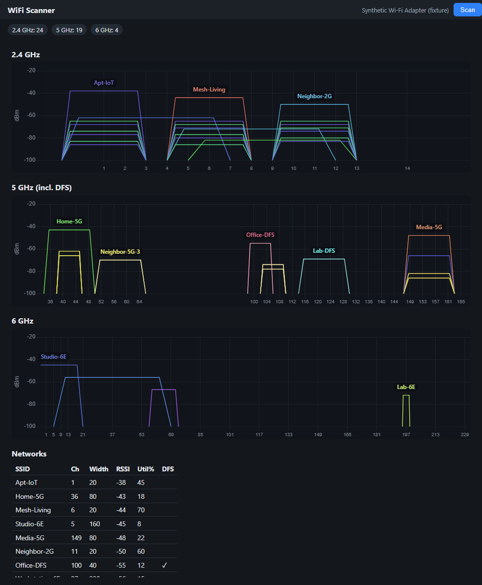

## Disclaimer

It's vibecoded, but it works well! Anyways, here's the AI slop:

# WiFi Scanner

<p align="center">
  
</p>

A small Windows and macOS Wi-Fi scanner focused on showing channel overlap and congestion across **2.4 GHz**, **5 GHz / DFS**, and **6 GHz / Wi-Fi 6E**.


## Features

- Channel graphs with flat-top trapezoids that show channel width.
- Live scan data from Windows Native Wi-Fi and macOS CoreWLAN.
- Per-band panels for 2.4 GHz, 5 GHz / DFS, and 6 GHz.
- Default labels for networks that are strongest across their full channel width.
- Snap-hover highlighting with SSID and RSSI dBm.
- QBSS channel-utilization parsing when an AP advertises it.
- Small Tauri desktop app with a web-based UI.



## Requirements

- Windows 11 or macOS on Apple Silicon
- A Wi-Fi adapter capable of the bands you want to scan
- **Location Services enabled**
- Windows: Admin/UAC approval when launching the app

Windows gates detailed Wi-Fi scan data behind both elevation and Location Services. macOS gates SSID/BSSID scan details behind Location Services permission for the app.

## Build / run

```powershell
npm --prefix frontend install
cargo install tauri-cli --locked
cargo tauri build --no-bundle
```

The Windows exe is at:

```text
target\release\wifi-scanner-app.exe
```

On macOS, use the generated `.app` bundle under `src-tauri/target/release/bundle/macos/` when building with bundling enabled.

Apple has not reviewed downloaded macOS builds. If macOS blocks the first launch and does not show an **Open** button, open **System Settings > Privacy & Security** and choose **Open Anyway** for WiFi Scanner.
